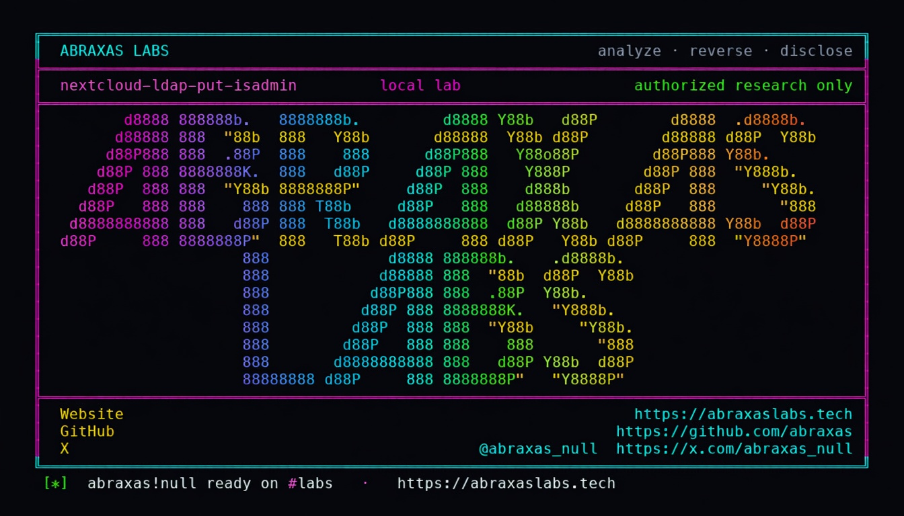

<p align="center">
  
</p>

<p align="center">
  <a href="https://abraxaslabs.tech"><strong>abraxaslabs.tech</strong></a>
  &nbsp;·&nbsp;
  <a href="https://github.com/abraxas">github.com/abraxas</a>
  &nbsp;·&nbsp;
  <a href="https://x.com/abraxas_null">@abraxas_null</a>
  &nbsp;·&nbsp;
  <a href="https://github.com/abraxas/nextcloud-ldap-put-isadmin">nextcloud-ldap-put-isadmin</a>
</p>

# nextcloud-ldap-put-isadmin

**Nextcloud Server** `35.0.0` - Nextcloud GmbH

PUT `/cloud/users/{id}` lets a delegated Users admin edit a target unless that target is in the **local** group `admin`. PATCH on the same path correctly uses `isAdmin()`. LDAP-promoted admins are `isAdmin()===true` and often **not** in that local group.

**A bad actor with the helpdesk-style Users job can disable, quota-lock, or delete a real LDAP-promoted instance admin. The newer PATCH API correctly refuses. The older PUT path does not.**

| | |
|---|---|
| ID | no CVE yet |
| CWE | [CWE-863](https://cwe.mitre.org/data/definitions/863.html) |
| CVSS | **High: 7.2** `CVSS:3.1/AV:N/AC:L/PR:H/UI:N/S:U/C:H/I:H/A:H` (delegated Users admin, not instance admin) |
| Product | [Nextcloud Server](https://github.com/nextcloud/server) |
| Affected | **35.0.0** (`da02f41`) official `nextcloud:35.0.0-apache` plus `user_ldap` |
| Auth | delegated Users admin vs LDAP-promoted admin |
| License | [GNU Affero GPL v3.0](LICENSE) |
| Lab | `127.0.0.1` only |

---

## What an attacker can do

On an LDAP site, you promoted an LDAP group to instance admin (`occ ldap:promote-group`). Those people are real admins (`isAdmin()===true`) but they may **not** sit in the local Nextcloud group named `admin`.

You also gave someone the **Users** settings job (helpdesk). They are not a full instance admin.

That helpdesk user can:

- **Change quota** on the LDAP-promoted admin (lab: PUT 200, PATCH 403)
- **Disable** or **delete** that admin (same `isInGroup` gate on enable/disable/delete/wipe)
- Reset password **if** the LDAP backend allows `canChangePassword()` (often false; do not depend on it)

They cannot do this to someone who is actually in the local `admin` group. They cannot do this on a site with no LDAP-promoted admins. The safer PATCH API already knows the difference.

---

## How I found it

Provisioning has two editors for the same user. `UsersController::editUser` is PUT. `editUserMultiField` is PATCH. Same file. Adjacent methods. Two different answers to "is this person an admin."

PUT checks `isInGroup($target, 'admin')`. PATCH checks `isAdmin($target)`. `Manager::isAdmin()` asks LDAP `IIsAdmin` then the local group. `occ ldap:promote-group` makes an LDAP group instance-admin without putting those uids in the local `admin` group.

I stood up official `nextcloud:35.0.0-apache` plus `osixia/openldap:1.5.0`. LDAP user `ldapadmin` in promoted group `ncadmins`: `isAdmin()===true`, not in local `admin`. Local `helpdesk` is delegated Users, not instance admin.

I sent PATCH first. It is the newer route. I expected PUT to match it. PATCH `{"quota":"1 GB"}` returned **403**. PUT `key=quota&value=1 GB` returned **200**. GET then showed quota `1073741824`.

---

## Lab

```bash
cd lab
./run.sh
```

Target **only** `http://127.0.0.1:18342` (OpenLDAP on compose DNS `ldap:389`).

```text
SUCCESS NEXTCLOUD-LDAP-PUT-ISADMIN who=delegated-users-admin target=ldapadmin put=200 patch=403 NEXTCLOUD-LDAP-PUT-ISADMIN-WITNESS
```

- [`lab/docker-compose.yml`](lab/docker-compose.yml)
- [`lab/Dockerfile`](lab/Dockerfile)
- [`lab/run.sh`](lab/run.sh)
- [`lab/ldap/50-seed.ldif`](lab/ldap/50-seed.ldif)
- [`lab/fixture.php`](lab/fixture.php)

---

## The fix

Use `isAdmin($target)` on PUT/disable/delete/wipe the same way PATCH already does.

---

## References

- [github.com/nextcloud/server](https://github.com/nextcloud/server) tag [v35.0.0](https://github.com/nextcloud/server/releases/tag/v35.0.0)
- LDAP promote: `occ ldap:promote-group` (PR `#41650`)
- Abraxas Labs: [abraxaslabs.tech](https://abraxaslabs.tech) · [github.com/abraxas](https://github.com/abraxas) · [@abraxas_null](https://x.com/abraxas_null)

---

## License

GNU Affero GPL v3.0. See [LICENSE](LICENSE). Loopback lab only. No warranty.
